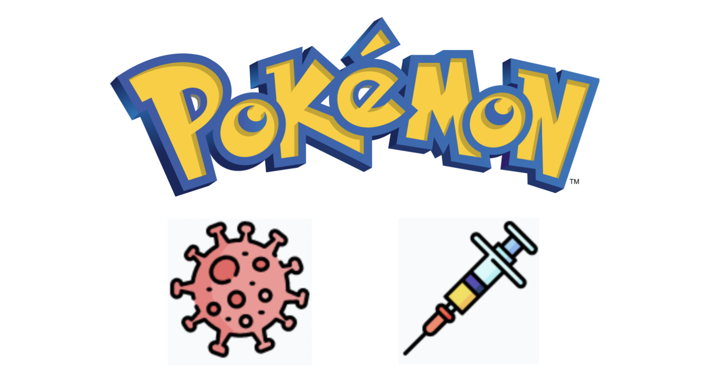

# Pokemon Covid/Vaccine

## Welcome to the next generation of Pokemon!

Take on this challenge to become the Pokemon Master! Play with your favorite Pokemons, and just like any previous games, discover the new ones from this generation: Corongo and Vax!!! 

**PLAY IT [HERE]!**(https://henriquemorikawa.github.io/Project-1-Pokemon-Ironhack/)

### Intructions

If you've never played any Pokemon game before (if that's even possible), it follows the classic Pokemon Battle gameplay, with your Pokemon on the left bottom side and your opponent's (PC) on the right upper side. Both teams will always be composed of **3** random generated Pokemons, and your goal is to beat every Pokemon on your opponent's side. In other words, all 3 Pokemons need to have their Health Points (HP) equal to **ZERO**. Whoever achieve this first, wins the game.

Every Pokemon can perform 4 actions:

**1. Fight:** yep, this one makes your Pokemon attack (surprised Pikachu)
**2. +HP:** Increase your Pokemon health like magic!
**3. +Att:** like going to the gym, but your Pokemon will actually be stronger (to attack)
**4. -Def:** kinda makes your opponent's more fragile, but to attacks, not Twitter comments

And if you are really ~~noob~~new to Pokemon, each one of them have their own stats, meaning they have different Attack, Defense and Speed. Most of the stats were based on the following [source](https://pokemondb.net/pokedex/all). Also remember: whoever has the higher Speed will attack first (surprised Pikachu appears again)

### Notes

This game was developed as part of a Project from the **Ironhack Web Development Bootcamp!**

Unfortunately, the game doesn't contain all 898 (as of 2021) different Pokemons, nor does it have types (water, fire, grass, etc), so yeah, your Charizard will finally be able to beat that Blastoise.

With time though, I will add these and other features to the game. I hope you enjoy! :)

**PS:** all Pokemon icons came from this amazing [source](https://www.behance.net/gallery/43311747/Pokmon-icons)